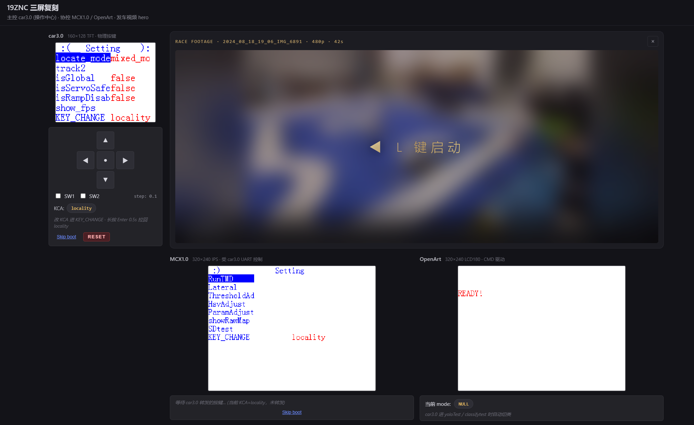

# 19ZNC 三屏复刻

[](./Snipaste_2026-05-17_16-23-42.png)

一个纯静态网页，复刻 2024 智能车竞赛 19ZNC 车队三块微控制器——**car3.0（主控）**、**MCX1.0（协控）**、**OpenArt（协控）**——的屏幕 UI。
完全从可观察的屏幕行为出发，不依赖任何竞赛源码。

**在线预览**：用浏览器直接打开 `index.html`，无需构建。

## 界面布局

- **左列 · 操作中心**：car3.0 的 160×128 TFT 屏 + 虚拟按键板（方向键、SW1/SW2、RESET）。只有 car3.0 拥有物理输入；MCX 通过 UART 接收 car3 转发的按键。
- **右上 · 发车视频**：真实比赛录像（2024-08-18）。未发车时覆盖香槟金渐变文字 **"◀ L 键启动"**，背景为视频帧的高斯模糊；发车后播放完整录像。视频黑边由第二层模糊放大的同帧画面填充（主流播放器同款 trick）。
- **右下 · 协控双屏**：MCX1.0（320×240 IPS）和 OpenArt（320×240 LCD180）并排显示，无物理按键。

## 快速开始

```bash
# 方式 1：直接用浏览器打开 index.html（file:// 在大多数浏览器可用）
# 方式 2：本地静态服务器
python -m http.server 8080
# 访问 http://localhost:8080
```

## 隐私声明 / 仓库边界

上级目录的竞赛固件（`../car3.0/`、`../MCX1.0/`、`../OpenArt/`）**故意不放入本仓库**。竞赛源码不能公开。

本仓库**仅**包含：
- 从 `zf_common_font.c` 抽出的 ASCII 8×16 位图字体（`assets/font_8x16.json`）。
- 手译的菜单结构 JSON（仅标签和布局数据，无执行逻辑）。
- 基于 reducer + render 模式重写的菜单状态机与屏幕渲染器。

**不涉及**：PID 算法、图像处理、分类模型、硬件驱动等竞赛核心代码。

## 文件结构

```
web-replica/
├─ index.html
├─ README.md
├─ .gitignore
├─ css/
│  ├─ layout.css          # 页面布局：左列操作中心 + 右列 hero + 协控双屏
│  └─ screen.css          # canvas 像素锐化、按键板、状态 pill
├─ js/
│  ├─ app.js              # 入口：加载资源、初始化三屏、启动渲染循环
│  ├─ font.js             # 8×16 位图渲染器
│  ├─ screen.js           # Screen 类：clear / drawText / drawImage
│  ├─ menu_engine.js      # 纯 reducer：onKey + render（car3/MCX 共用）
│  ├─ state.js            # 参数状态 + localStorage 持久化
│  ├─ keys.js             # 虚拟按键派发 + KCA 路由 + 长按 Enter
│  ├─ uart_bus.js         # EventTarget 跨屏事件总线
│  ├─ boot.js             # 三屏开机动画
│  ├─ runtime_screens.js  # function 类型菜单项的 mock 调试页
│  ├─ frames.js           # 加载真实相机帧
│  ├─ race.js             # 发车后的 car3/MCX 渲染器
│  └─ openart.js          # OpenArt READY! + CMD 驱动分类标签页
├─ assets/
│  ├─ font_8x16.json      # 95 字符 × 16 字节
│  ├─ race.mp4            # 480p H.264 比赛录像
│  ├─ sample_frames/      # 8 帧真实相机图像（BMP→JPG）
│  └─ Snipaste_*.png      # 项目截图
├─ data/
│  ├─ enums.json
│  ├─ menu_car3.json      # car3.0 根菜单（31 项）
│  ├─ menu_mcx.json       # MCX1.0 根菜单（8 项）
│  ├─ runtime_specs.json
│  ├─ submenus_car3/      # 19 个子菜单 JSON
│  └─ submenus_mcx/       # 2 个子菜单 JSON
└─ tools/
   └─ extract_font.mjs    # 一次性字体抽取脚本
```

## 架构速查

| 模块 | 说明 |
|------|------|
| **Screen** | 原生尺寸 canvas（car3: 160×128，MCX/OpenArt: 320×240），CSS 用 `image-rendering: pixelated` 放大显示 |
| **菜单引擎** | 纯状态机 + render 函数，car3 与 MCX 共用，通过 `spec` 对象区分行列数、标题装饰、参数列位置 |
| **参数状态** | 扁平 `key → number` 字典，存于 `localStorage["znc-state-v1"]`。R / Enter 保存并闪 "success" |
| **跨屏 UART** | `EventTarget` 总线，两条路由：<br>① KCA=`deviation` 时 car3 按键转发到 MCX<br>② car3 进入 `yoloTest` / `classifytest` 时发送 `openart_cmd`，OpenArt 订阅后切换显示 |
| **Runtime 页** | `function` 类菜单项（`motor_test`、`show_fps` 等）绘制 mock 数据，无真实遥测 |

## 发车与 RESET

对齐固件流程 `device_init() → MainMenu_Set() → begin_all() → run_TMD()`：

- **发车**：在 car3.0 根菜单按 **L**（◀），或点击 hero 视频区的 **"◀ L 键启动"** 遮罩
  - car3 切到 race 模式（相机帧 + 曲率/偏航/速度 overlay）
  - MCX 切到 race 模式（横向追踪遥测）
  - OpenArt 进入 `target_classification`（CMD `0x01`）
  - hero 视频开始播放
- **退出**：再按 **L**，或点击 hero 视频区右上角的 **×**

**RESET**（car3.0 面板上的红色按钮）——等效于整车断电重启：
1. 清空 localStorage 参数，恢复默认值
2. 三屏全部清屏并重放开机动画
3. 重置所有菜单栈到根

## 键盘快捷键

网页也支持键盘操作（焦点需在 car3.0 面板）：

| 按键 | 作用 |
|------|------|
| `↑` `↓` `←` `→` | U / D / L / R |
| `Enter` / `Space` | 确认 |
| `L`（根菜单） | 发车 |

长按 car3.0 的 **Enter** 0.5 秒可强制把 KCA 切回 `locality`（固件安全行为）。

## 重新生成字体

```bash
node tools/extract_font.mjs
```

读取 `../car3.0/libraries/zf_common/zf_common_font.c`，覆盖 `assets/font_8x16.json`。

## License

- 位图字体源自 SeekFree `zf_common_font.c`（GPLv3），按该许可证包含。
- 手译菜单 JSON 仅含标签和布局描述数据。
- 其余代码为 clean-room 复刻。
